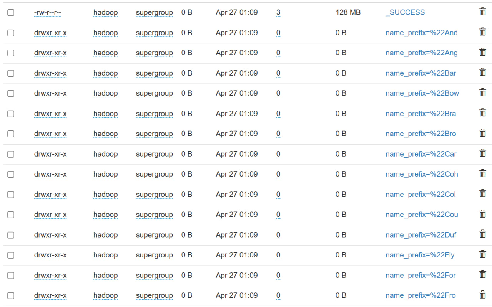

# ДЗ 5 - Реализация процесса обработки данных

Бугаков Максим БПИ226

---
### 1. Подключение к серверу

Прокидываем порты с кластера на локалхост
```bash
ssh -L 9870:127.0.0.1:9870 -L 8088:127.0.0.1:8088 -L 19888:127.0.0.1:19888 team@176.109.91.25
```
Переключаемся на пользователя hadoop
```bash
sudo -i -u hadoop
```

---
### 2. Настройка зависимостей Python


```bash
source venv/bin/activate
pip install prefect
```


---
### 3. Написание процесса обработки данных
Чтобы выполнить данный пункт, нужно, чтобы корректно работал Spark (как мы сделали в ДЗ 4)

Создаем файл `python_dag.py`, в котором пишем следующий код

```python
from pyspark.sql import SparkSession, functions as F
from onetl.connection import SparkHDFS, Hive
from onetl.file import FileDFReader
from onetl.file.format import CSV
from onetl.db import DBWriter
from prefect import flow, task

@task
def get_spark():
    return (
        SparkSession.builder
        .master("yarn")
        .appName("spark-with-yarn-titanic")
        .config("spark.sql.warehouse.dir", "/user/hive/warehouse")
        .config("spark.hive.metastore.uris", "thrift://tmpl-jn:9083")
        .enableHiveSupport()
        .getOrCreate()
    )

@task
def stop_spark(spark):
    spark.stop()

@task
def extract(spark):
    hdfs = SparkHDFS(host="tmpl-nn", port=9000, spark=spark, cluster="test")
    reader = FileDFReader(
        connection=hdfs,
        format=CSV(delimiter=",", header=True),
        source_path="/input"
    )
    df = reader.run(["titanic.csv"])
    return df

@task
def transform(df):
    return df.withColumn("name_prefix", F.col("Name").substr(1, 4))

@task
def load(spark, df):
    hive = Hive(spark=spark, cluster="test")
    writer = DBWriter(
        connection=hive,
        table="test3.titanic_prefix",
        options={
            "if_exists": "replace_entire_table",
            "partitionBy": "name_prefix"
        }
    )
    writer.run(df)

@flow
def process_titanic():
    spark = get_spark()
    df = extract(spark)
    df_prefixed = transform(df)
    load(spark, df_prefixed)
    stop_spark(spark)

if __name__ == "__main__":
    process_titanic()
```

---
### 4. Запуск процесса
```bash
python python_dag.py
```
В результате у нас появилась новая таблица с разделением данных по новому полю `name_prefix`



